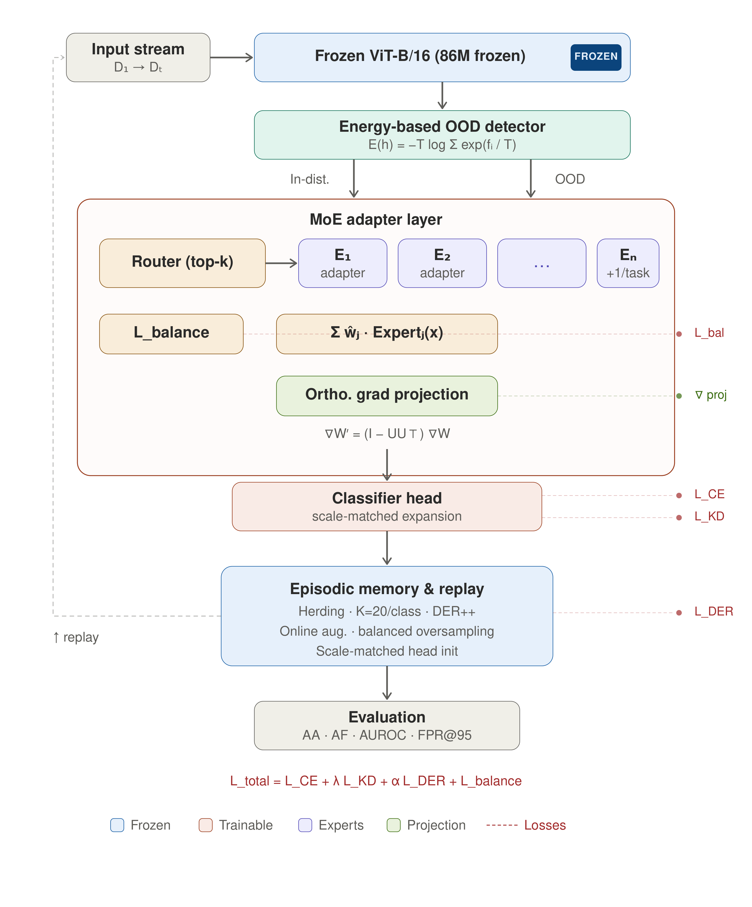

# EnRoute-CIL: Energy-Guided Routed Continual Learning for Intelligent Cockpit 

[](https://opensource.org/licenses/MIT)
[](https://pytorch.org/)
[](https://doi.org/10.5281/zenodo.18873097)

Research repository for **EnRoute-CIL**, a frozen-ViT continual learning framework for intelligent cockpit. The current codebase focuses on **open-world continual adaptation** under strict edge-side constraints, with a practical design centered on the **system-level synthesis** of replay, adapters, energy-based uncertainty, and smooth expert routing.


## Abstract

Deployed intelligent-cockpit systems must adapt to newly emerging driver behaviors without uploading private in-cabin data, retraining the full backbone, or catastrophically forgetting previously learned habits. EnRoute-CIL addresses this setting with a **frozen ViT backbone**, **adapter-based parameter-efficient updates**, **Mixture-of-Experts (MoE) growth**, and an **offline energy-guided routing mechanism**.

The key design choice is to treat high-energy observations not as a driver-facing annotation event, but as an **offline trigger for controlled expert activation**. A dormant expert is awakened only after sufficient OOD evidence has accumulated. To prevent the newly activated expert from dominating the router under limited new-class evidence, the framework introduces a **smooth routing regularizer** (`L_skew`) that biases the gate distribution gradually rather than through hard expert switching.

Under a unified 3-seed, 5-epoch benchmark on **Split CIFAR-100** and **State Farm Distracted Driver Detection**, EnRoute-CIL studies a constrained regime defined by **privacy preservation, replay budget `K=20`, and rapid edge-side adaptation**. The main contribution is not a claim of absolute asymptotic superiority over all prompt methods, but a demonstration that the proposed system design achieves a stronger **accuracy-forgetting trade-off in rapid adaptation scenarios**.

## Research Positioning

This project belongs primarily to **continual learning / machine learning**, with an application focus on **intelligent cockpit** in a broader human-centered AI setting.

More specifically, the repository studies:

- **class-incremental learning** under a frozen pre-trained vision backbone;
- **parameter-efficient adaptation** through adapters and MoE modules;
- **open-world behavior adaptation** via energy-based uncertainty signals;
- **edge-oriented deployment trade-offs**, where adaptation must remain lightweight and privacy-conscious.

## Method Overview

EnRoute-CIL combines four coupled components:

1. **Frozen ViT backbone**
   - The pre-trained transformer backbone remains fixed.
   - Only lightweight adaptation modules are updated.

2. **Adapter / MoE-based continual adaptation**
   - Standard adapter baseline for strong parameter-efficient rehearsal.
   - Optional dynamic MoE growth for additional task-specific capacity.

3. **Energy-based OOD scoring**
   - High-energy samples are treated as evidence that the current representation is insufficient.
   - OOD detection is used in an **offline** adaptation loop rather than a real-time in-drive interaction loop.

4. **Energy-guided smooth routing (`L_skew`)**
   - When enough OOD evidence accumulates, routing is gradually biased toward a dormant expert.
   - This is intended to reduce modal overlap and prevent abrupt overfitting to newly observed behavior fragments.


Framework figure:



## Benchmark Protocol

The repository now contains a unified benchmark harness covering:

- **Methods**
  - `ours`
  - `ours_baseline`
  - `l2p`
  - `coda_prompt`
  - `moe_adapters`

- **Datasets**
  - `cifar100`
  - `statefarm`

- **Seeds**
  - `{42, 43, 44}`

- **Epoch budget**
  - `5 epochs` per task

Task schedules:

- **CIFAR-100**: `50 + 10 x 5`
- **State Farm**: `5 + 1 x 5`

Reported metrics:

- `AA` (Average Accuracy)
- `AF` (Average Forgetting)
- `Final Old-Task Accuracy`
- `Trainable Ratio`
- `OOD AUROC / FPR@95TPR` when exported by the benchmark wrapper
- `AA std / AF std` across 3 seeds

The canonical benchmark artifacts are stored under:

```text
output/benchmark_sota/
```

The top-level aggregate files are:

- `output/benchmark_sota/benchmark_overview.md`
- `output/benchmark_sota/benchmark_overview.csv`
- `output/benchmark_sota/benchmark_overview.json`

### Disclaimer

This benchmark is intentionally conducted under a **strict physical budget**:

- `5 epochs` per task
- bounded replay memory (`K=20`)
- frozen backbone updates only
- privacy-conscious, edge-side adaptation assumptions

Under this regime, traditional prompt-based methods are **not expected to reach their theoretical best performance**. Their slower gradient accumulation and weaker plasticity under short-horizon adaptation can make them appear overly rigid. Accordingly, the benchmark **does not claim that EnRoute-CIL asymptotically surpasses CODA-Prompt or L2P in absolute capacity**. The claim is narrower and more practical:

> **Under rapid adaptation constraints, EnRoute-CIL offers a materially better system-level trade-off between learning speed, accuracy, and forgetting.**

## Main Results

### CIFAR-100: Cross-Paradigm Comparison

Results below use the completed 3-seed benchmark artifacts in `output/benchmark_sota/cifar100/`.

| Method | AA (mean ± std) | AF (mean ± std) | Final Old-Task Acc | Trainable Ratio | OOD AUROC |
|---|---:|---:|---:|---:|---:|
| **EnRoute-CIL (ours)** | **86.02% ± 0.78%** | 10.25% ± 0.70% | **84.55% ± 0.81%** | 1.45% | - |
| L2P | 74.11% ± 1.50% | **1.83% ± 0.13%** | 74.99% ± 2.23% | **0.65%** | 0.8334 |
| CODA-Prompt | 79.31% ± 1.60% | 2.17% ± 0.18% | 80.17% ± 2.16% | 4.37% | **0.8836** |
| MoE-Adapters4CL | 79.68% ± 0.76% | 7.34% ± 0.35% | 78.87% ± 1.13% | 100.00% | 0.8333 |

### CIFAR-100: Ours vs Frozen-ViT Adapter Baseline

This comparison isolates the contribution of the energy-guided routing mechanism against the repository's frozen-ViT adapter baseline.

| Configuration | AA (mean ± std) | AF (mean ± std) | Final Old-Task Acc |
|---|---:|---:|---:|
| Frozen ViT + Adapter (`ours_baseline`) | 85.10% ± 1.38% | 14.23% ± 1.73% | 82.54% ± 1.76% |
| **EnRoute-CIL (`ours`)** | **86.02% ± 0.78%** | **10.25% ± 0.70%** | **84.55% ± 0.81%** |

Observed deltas (`ours - baseline`):

- `AA`: `+0.91` percentage points
- `AF`: `-3.98` percentage points
- Relative forgetting reduction: `27.94%`

### State Farm: Cross-Paradigm Comparison

Results below use the completed 3-seed benchmark artifacts in `output/benchmark_sota/statefarm/`.

| Method | AA (mean ± std) | AF (mean ± std) | Final Old-Task Acc | Trainable Ratio | OOD AUROC |
|---|---:|---:|---:|---:|---:|
| **EnRoute-CIL (ours)** | **67.19% ± 3.11%** | 30.58% ± 5.86% | **64.22% ± 3.30%** | 1.38% | - |
| L2P | 16.10% ± 1.68% | 2.76% ± 0.35% | 18.78% ± 2.42% | **0.57%** | 0.5537 |
| CODA-Prompt | 15.23% ± 0.66% | **0.08% ± 0.05%** | 18.27% ± 0.79% | 4.29% | **0.6447** |
| MoE-Adapters4CL | 29.95% ± 10.02% | 3.05% ± 3.89% | 35.88% ± 12.08% | 100.00% | 0.5523 |

## Ablation Study

### Public System Ablation: Full EnRoute-CIL vs Adapter Baseline

The strongest public ablation currently shipped in this repository compares the full EnRoute-CIL system against the frozen-ViT adapter baseline. This is a **system-level ablation**, not a pure single-switch toggle, but it captures the practical effect of adding the routed adaptation stack centered on `L_skew`.

| Configuration | AA (mean ± std) | AF (mean ± std) | Relative AF |
|---|---:|---:|---:|
| Frozen ViT + Adapter (`ours_baseline`) | 85.10% ± 1.38% | 14.23% ± 1.73% | 100% |
| **Full EnRoute-CIL** | **86.02% ± 0.78%** | **10.25% ± 0.70%** | **72.06%** |

This ablation is important precisely because the absolute gain in `AA` is modest (`+0.91` points), while the forgetting reduction is much larger in relative terms (`-27.94%`). That is the engineering signal the repository is built around: **small accuracy gains can hide substantial stability gains**.

Current ablation artifacts are summarized from:

- `output/benchmark_sota/cifar100/ours/multiseed_summary.json`
- `output/benchmark_sota/cifar100/ours_baseline/multiseed_summary.json`

For a dedicated ablation note, see:

- `ablation_studies/README.md`

## Result Interpretation

The current benchmark supports three empirical observations.

1. **Low forgetting is not sufficient evidence of useful adaptation.**
   - On both datasets, prompt-based baselines (`L2P`, `CODA-Prompt`) show very small `AF`.
   - Under the strict `5-epoch` budget, this low forgetting coexists with substantially lower `AA`, suggesting a more rigid adaptation regime rather than a superior plasticity-retention trade-off.

2. **Adapter-space intervention is more sample-efficient than input-prompt intervention in this repository's setting.**
   - Under identical epoch and seed budgets, the frozen-ViT adapter route remains substantially more plastic than prompt-only baselines.
   - This is especially visible on `State Farm`, where the low-increment (`5 + 1 x 5`) schedule strongly stresses new-class adaptation.

3. **Energy-guided smooth routing improves the repository's own baseline trade-off.**
   - Relative to the frozen-ViT adapter baseline, EnRoute-CIL gains `+0.91` AA points on CIFAR-100 while reducing forgetting by `27.94%`.
   - This supports the interpretation that `L_skew` helps constrain overfitting pressure during expert activation, rather than simply adding more parameters.
   - The key sell here is the **architecture trade-off**, not an inflated claim that the routing mechanism alone is the entire contribution.

These are **setting-bounded** observations. They apply to the current protocol, implementation family, and epoch budget; they should not be generalized to all PEFT-CIL settings without further evidence.

## Reproducibility

### Environment

Recommended environment:

```bash
conda create -n cockpit python=3.10 -y
conda activate cockpit
pip install -r requirements.txt
pip install tensorboard
pip install -r third_party/CODA-Prompt/requirements.txt
pip install -r third_party/MoE-Adapters4CL/cil/requirements.txt
```

### Single-Run Training

Example EnRoute-CIL run:

```bash
python main.py --epochs 5 \
  --use_moe \
  --use_energy_ood \
  --use_ood_expert_routing \
  --use_ortho_proj \
  --der_alpha 0.3 \
  --ood_router_lambda 0.2 \
  --ood_router_temperature 1.0 \
  --ood_trigger_min_count 20 \
  --ood_trigger_min_ratio 0.05 \
  --output_dir output/ood_router_proto \
  --save_best
```

### Unified Multi-Seed Benchmark

```bash
python scripts/run_multiseed.py \
  --benchmark \
  --seeds 42 43 44 \
  --methods ours l2p coda_prompt moe_adapters \
  --datasets cifar100 statefarm \
  --epochs 5 \
  --batch_size 64 \
  --num_workers 8 \
  --fast_mode \
  --skip_existing \
  --output_root output/benchmark_sota
```

### Staged Cloud Script

The repository also includes a staged launcher:

```bash
./training.sh
```

`training.sh` first validates `cifar100` on `ours + l2p + coda_prompt`, then continues to `moe_adapters`, and finally runs the `statefarm` benchmark with built-in output checks.

## Data Preparation

### CIFAR-100

The benchmark uses:

```text
data/raw/cifar100/
```

### State Farm

Supported raw forms:

```text
data/raw/statefarm/driver_imgs_list.csv + imgs/train/...
data/raw/statefarm/state-farm-distracted-driver-detection.zip
```

The wrapper will automatically prepare:

```text
data/processed/statefarm_cl/train
data/processed/statefarm_cl/test
```

If `driver_imgs_list.csv` is available, the split is driver-aware; otherwise a class-wise random split is used.

## Output Artifacts

For each method and seed, the benchmark writes:

- `benchmark_summary.json`
- `acc_matrix.npy`
- `assets/`

For each method aggregate:

- `multiseed_summary.json`
- `multiseed_summary.md`
- `mean_acc_matrix.npy`
- `std_acc_matrix.npy`

For the whole benchmark:

- `benchmark_overview.md`
- `benchmark_overview.csv`
- `benchmark_overview.json`

These files are the authoritative source for the result tables reported in this README.

## Analysis Scripts

To support future forensic-style analysis of feature collapse and expert specialization, the repository now includes two generic visualization utilities:

```bash
python scripts/visualize_feature_tsne.py \
  --features path/to/features.npy \
  --labels path/to/labels.npy \
  --output output/analysis/tsne.png \
  --title "Feature t-SNE"
```

```bash
python scripts/plot_tensor_heatmap.py \
  --input path/to/weights.npy \
  --output output/analysis/heatmap.png \
  --title "Prompt or Router Weights"
```

These scripts are meant to support:

- t-SNE feature-space inspection across tasks or methods
- prompt-weight / router-weight heatmaps
- future visual evidence comparing prompt collapse vs expert specialization

## Repository Layout

```text
EnRoute-CIL/
├── main.py
├── trainer.py
├── config.py
├── training.sh
├── models/
├── utils/
├── scripts/
│   ├── run_multiseed.py
│   ├── run_benchmark_method.py
│   └── plot_results.py
├── benchmarks/
│   └── common.py
├── third_party/
│   ├── CODA-Prompt/
│   └── MoE-Adapters4CL/
├── paper/
├── output/
└── docs/
```

## Limitations & Future Work

**Extreme Budget Trade-offs**: The current benchmark strictly operates under a 5-epoch budget to simulate rapid edge-side adaptation. The resulting accuracy-forgetting trade-offs emphasize immediate plasticity. Future work will explore dynamic epoch scheduling based on the vehicle's offline duration (e.g., overnight charging vs. brief parking).

**Representation Bottleneck in Complex Scenes**: The State Farm dataset remains highly challenging. Although EnRoute-CIL achieves the highest AA in the current setting, the AF remains at 30.58% ± 5.86%. This indicates a fundamental representation bottleneck when handling long incremental sequences of complex, highly-overlapped driver poses using a fixed-capacity ViT.

**Foundation Model Integration (CLIP)**: While the current framework utilizes an ImageNet-pretrained ViT, migrating the frozen backbone to Vision-Language foundation models (e.g., CLIP) is a highly promising next step. Leveraging CLIP's robust semantic feature space could significantly stabilize the Energy OOD triggers and enhance zero-shot rapid adaptation for unseen in-cabin behaviors.

**Empirical Interpretability**: A stricter future step is to natively couple intermediate feature extraction and gating statistics with the unified benchmark harness. Using the included visualization scripts, we aim to provide direct, mechanical evidence of how prompt-based methods experience feature collapse, whereas routed-expert methods maintain functional specialization by the final epoch.

**Unified Metric Telemetry**: Currently, OOD AUROC tracking is more decoupled for baseline wrappers than for our native method. Unifying the real-time OOD logging across all third-party continuous learning wrappers remains an ongoing engineering effort to support finer-grained anomaly analysis.
## License

This project is released under the MIT License. See [LICENSE](LICENSE) for details.
