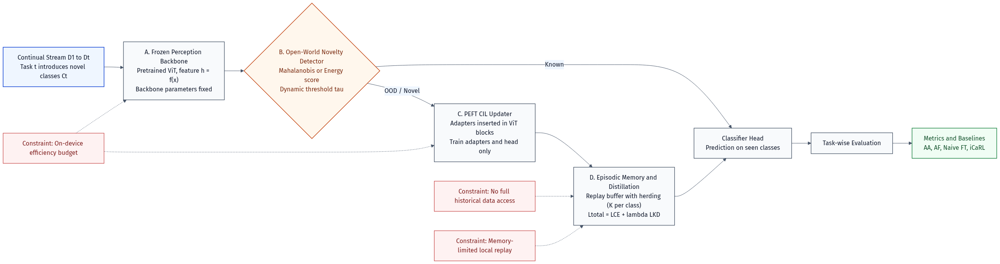

# ERO-MoE-CIL: Privacy-Preserving Open-World Continual Learning for Intelligent Cockpit

[](https://opensource.org/licenses/MIT)
[](https://pytorch.org/)
[](https://doi.org/10.5281/zenodo.18873097)

Research codebase for **ERO-MoE-CIL**, a frozen-ViT continual learning framework for intelligent cockpit personalization. The current project focus is **open-world continual adaptation with energy-guided expert expansion** under a parameter-efficient setting.

## Abstract

In real-world autonomous systems (e.g., intelligent cockpits), AI models inevitably encounter out-of-distribution (OOD) behaviors after deployment. Traditional Parameter-Efficient Class-Incremental Learning (PEFT-CIL) methods rely on human-provided task boundaries and struggle to adapt autonomously. 

Our framework introduces an **offline, energy-guided dynamic expert activation mechanism**. When an unknown behavior triggers the energy threshold, the system autonomously wakes up a dormant MoE expert. To prevent the newly added expert from overfitting to limited newly discovered samples, we design a **Smooth Routing Regularization ($\mathcal{L}_{skew}$)** that mathematically guides the MoE gate distribution, ensuring a seamless transition between old and new knowledge.

## Core Idea

The repository is centered on four coupled components:

- **Frozen ViT backbone**: keep the pre-trained backbone fixed and update only lightweight adaptation modules.
- **MoE adapters with dynamic growth**: expand expert capacity incrementally instead of full-model fine-tuning.
- **Energy-based OOD detection**: use classifier energy to detect behavior patterns outside the current in-distribution set.
- **Offline OOD-triggered expert routing**: cache high-energy samples offline, then bias routing toward a dormant expert with a smooth regularizer once enough OOD evidence has accumulated.

This keeps the method aligned with intelligent-cockpit constraints:
- no real-time driver-facing annotation loop;
- no unconditional expert explosion;
- no dependence on a fixed hand-tuned OOD threshold without calibration.

## Framework Figure



## Key Implementation Points

- Exemplars are stored as raw PIL images and transformed online.
- Replay can be oversampled to reduce new/old imbalance.
- Classifier expansion uses scale-matched initialization.
- Orthogonal projection uses a block-projection strategy for dynamically expanded parameters.
- OOD-triggered expert routing is implemented as an **offline** mechanism, not as an in-drive HITL workflow.
- Benchmark wrappers are included for `ours`, `l2p`, `coda_prompt`, and `moe_adapters` under a unified multi-seed protocol.

## Repository Structure

```text
Personalized-Cockpit-CIL/
├── main.py
├── trainer.py
├── config.py
├── models/
│   ├── vit_adapter.py
│   └── moe_adapter.py
├── utils/
│   ├── data_utils.py
│   ├── herding.py
│   ├── energy_ood.py
│   ├── orthogonal_projection.py
│   └── metrics.py
├── scripts/
│   ├── plot_results.py
│   ├── run_multiseed.py
│   └── run_benchmark_method.py
├── benchmarks/
│   └── common.py
├── third_party/
└── docs/
```

## Environment

Recommended setup:

```bash
conda create -n cockpit python=3.10 -y
conda activate cockpit
pip install -r requirements.txt
pip install tensorboard
```

## Quick Start

Single-run training:

```bash
python main.py --epochs 5 \
  --use_moe --use_energy_ood --use_ood_expert_routing --use_ortho_proj \
  --der_alpha 0.3 \
  --ood_router_lambda 0.2 \
  --ood_router_temperature 1.0 \
  --ood_trigger_min_count 20 \
  --ood_trigger_min_ratio 0.05 \
  --output_dir output/ood_router_proto \
  --save_best
```

This configuration is designed for **post-trip adaptation**: the system buffers high-energy segments offline and only activates a dormant expert when trigger conditions are satisfied.

## Unified Benchmark

The repository now includes a unified benchmark harness for representative PTM/PEFT continual-learning baselines.

Supported methods:
- `ours`
- `l2p`
- `coda_prompt`
- `moe_adapters`

Supported datasets:
- `cifar100`
- `statefarm`

One-click benchmark command:

```bash
python scripts/run_multiseed.py \
  --benchmark \
  --seeds 42 43 44 \
  --methods ours l2p coda_prompt moe_adapters \
  --datasets cifar100 statefarm \
  --epochs 5 \
  --batch_size 64 \
  --num_workers 8 \
  --fast_mode \
  --skip_existing \
  --output_root output/benchmark_sota
```

Outputs:
- per-seed: `benchmark_summary.json`
- per-method aggregate: `multiseed_summary.json`, `multiseed_summary.md`, `mean_acc_matrix.npy`
- global overview: `benchmark_overview.md`, `benchmark_overview.csv`, `benchmark_overview.json`

Unified metrics:
- `AA`
- `AF`
- `Final Old-Task Accuracy`
- `trainable_params / total_params / trainable_ratio`
- `OOD AUROC / FPR@95TPR`
- `AA std / AF std`

## CIFAR-100 Result Snapshot (Ours vs Baseline)

Using the completed 3-seed benchmark outputs under:

- `output/benchmark_sota/cifar100/ours/multiseed_summary.json`
- `output/benchmark_sota/cifar100/ours_baseline/multiseed_summary.json`

where `ours_baseline` keeps the frozen ViT + standard adapter pipeline, and `ours` adds the energy-guided MoE routing mechanism with smooth routing regularization (`L_skew`), the CIFAR-100 comparison is:

| Configuration | AA (mean ± std) | AF (mean ± std) |
|---|---:|---:|
| Baseline (`ours_baseline`) | 85.10% ± 1.38% | 14.23% ± 1.73% |
| Ours (`energy-guided MoE + L_skew`) | 86.02% ± 0.78% | 10.25% ± 0.70% |

Observed deltas (Ours - Baseline):

- `AA`: `+0.91` percentage points
- `AF`: `-3.98` percentage points
- Relative forgetting reduction: `27.94%` (`(AF_base - AF_ours) / AF_base`)

This result provides direct evidence that `L_skew` is effective at reducing forgetting/overfitting pressure in this benchmark setting, while preserving a modest AA gain.

## CIFAR-100 Interpretation vs Prompt and MoE Baselines

Under the same 5-epoch, 3-seed benchmark protocol on CIFAR-100:

| Method | AA (mean ± std) | AF (mean ± std) | Final-task Acc (mean) |
|---|---:|---:|---:|
| Ours (`energy-guided MoE + L_skew`) | 86.02% ± 0.78% | 10.25% ± 0.70% | 93.33% |
| Ours Baseline (`frozen ViT + adapter`) | 85.10% ± 1.38% | 14.23% ± 1.73% | 97.90% |
| L2P | 74.11% ± 1.50% | 1.83% ± 0.13% | 69.67% |
| CODA-Prompt | 79.31% ± 1.60% | 2.17% ± 0.18% | 75.03% |
| MoE-Adapters4CL | 79.68% ± 0.76% | 7.34% ± 0.35% | 83.70% |

Interpretation:

- Prompt-family baselines (`L2P`, `CODA-Prompt`) show very low AF, but also much lower AA and lower final-task accuracy in this strict-epoch setting, indicating higher rigidity (limited plastic adaptation to new tasks).
- Compared with our adapter baseline, EnRoute-CIL improves system-level balance: `+0.91` AA points and `-3.98` AF points (`-27.94%` relative AF), while keeping high final-task learning capability.
- This supports (not universally proves) the role of `L_skew` in reducing expert-space overfitting and modal overlap under constrained compute budgets.

Implementation note:
- `L2P` is benchmarked through the vendored PyTorch `L2P` implementation inside `third_party/CODA-Prompt` so that prompt-family baselines run under one unified protocol.
- `MoE-Adapters4CL` remains a cross-paradigm comparison because it is CLIP/VLM-based.

## Data Notes

### CIFAR-100

Use the existing `data/raw/` path.

### State Farm

Place the raw dataset under:

```text
data/raw/statefarm/
```

Supported raw forms:

```text
data/raw/statefarm/driver_imgs_list.csv + imgs/train/...
data/raw/statefarm/state-farm-distracted-driver-detection.zip
```

The benchmark wrapper will automatically unpack the zip form if needed and prepare:

```text
data/processed/statefarm_cl/train
data/processed/statefarm_cl/test
```

If `driver_imgs_list.csv` is present, the split is driver-based. Otherwise, it falls back to a class-wise random split.

## License

This project is licensed under the MIT License. See [LICENSE](LICENSE) for details.
