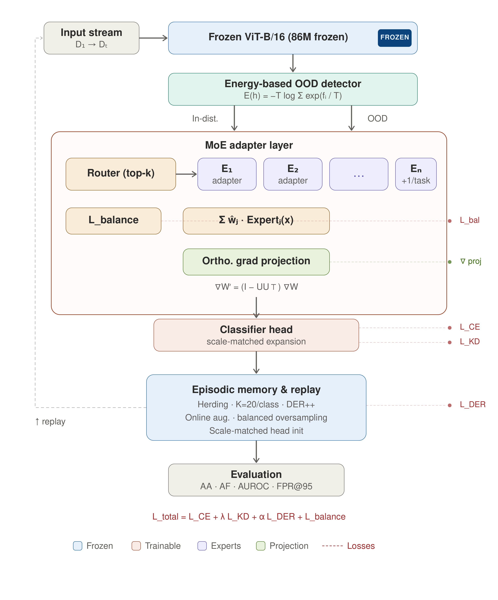

# EnRoute-CIL

**Energy-Guided Routed Continual Learning for Intelligent Cockpit**

[](https://opensource.org/licenses/MIT)
[](https://pytorch.org/)
[](https://doi.org/10.5281/zenodo.18873097)

---

## Key Finding

> **Fixing your replay data pipeline matters more than adding fancy modules.**
>
> We built a full frozen-ViT continual learning system (MoE adapters + energy OOD + orthogonal projection + DER++ + WA), then discovered that **none of these modules help — and some actively hurt — until three data-pipeline-level issues are fixed**: online exemplar augmentation, balanced replay oversampling, and scale-matched classifier head initialization.
>
> Once fixed, the same system jumps from 81.28% → 86.84% AA and 18.72% → 7.87% AF on Split CIFAR-100.

---

## Why This Repo Exists

Most PEFT-CIL papers focus on **what modules to add** (prompts, adapters, experts, projection losses). This repo provides controlled evidence that, at least in replay-based frozen-ViT settings, **how you feed replay data to those modules** can dominate the outcome.

We release the full codebase so others can:
- **Reproduce** our 4-configuration × 3-seed ablation and cross-method benchmark
- **Check** whether the pipeline-fix finding holds in their own PEFT-CIL setup
- **Use** the energy-guided MoE + replay system as a starting point for cockpit / edge CIL work

---

## Key Results

### Cross-Method Comparison (3-seed mean ± std, 5 epochs/task)

**CIFAR-100** (50 + 10×5):

| Method | AA (%) | AF (%) |
|--------|--------|--------|
| L2P | 74.11 ± 1.50 | 1.83 ± 0.13 |
| CODA-Prompt | 79.31 ± 1.60 | 2.17 ± 0.18 |
| MoE-Adapters | 79.68 ± 0.76 | 7.34 ± 0.35 |
| **EnRoute-CIL** | **86.02 ± 0.78** | 10.25 ± 0.70 |

**State Farm Distracted Driver** (5 + 1×5):

| Method | AA (%) | AF (%) |
|--------|--------|--------|
| L2P | 16.10 ± 1.68 | 2.76 ± 0.35 |
| CODA-Prompt | 15.23 ± 0.66 | 0.08 ± 0.05 |
| MoE-Adapters | 29.95 ± 10.02 | 3.05 ± 3.89 |
| **EnRoute-CIL** | **67.19 ± 3.11** | 30.58 ± 5.86 |

> **Note on forgetting**: Our AF is the highest — but competing methods achieve low AF because they barely learn new classes (AA < 30% on State Farm). Low forgetting is meaningless when there's nothing to forget.

### Ablation: Where Does the Gain Come From? (3-seed mean)

| Configuration | AA (%) | AF (%) | What changed |
|--------------|--------|--------|-------------|
| Baseline (Adapter + KD) | 85.10 | 14.23 | — |
| + MoE + OOD + OP | 83.17 | 16.06 | ❌ Got worse |
| + DER++ + WA | 81.28 | 18.72 | ❌ Even worse |
| **+ Data Pipeline Fix** | **86.84** | **7.87** | ✅ +5.56 AA, −10.85 AF |

The pipeline fix alone accounts for **all** of the improvement. The architecture modules become useful only *after* the data pipeline is repaired.

> ⚠️ Ablation uses a dedicated training config; full-method AA differs by ≤1% from the cross-method table due to memory-optimization flags. See paper for details.

---

## What's in the Pipeline Fix

Three changes, each addressing a specific failure mode in replay-based frozen-ViT CIL:

| Fix | Problem it solves | One-liner |
|-----|------------------|-----------|
| **Online exemplar augmentation** | Stored-as-tensor exemplars get memorized pixel-for-pixel | Store raw PIL images, augment on-the-fly every epoch |
| **Balanced replay oversampling** | 20 exemplars vs 500 new-class samples → old classes starved | Repeat exemplar set to match new-class batch proportion |
| **Scale-matched head init** | Kaiming init for new classifier rows → logit scale mismatch | Init new rows with N(0, σ²_old) from existing weights |

None of these are novel ideas individually. The contribution is showing that **they collectively dominate** MoE/OOD/OP/DER++/WA in this setting.

---

## System Architecture

Beyond the pipeline fix, the repo implements a complete frozen-ViT CIL system:



```
Input → Frozen ViT-B/16 (86M frozen)
           ↓
     MoE Adapter Layer (top-k routing, +1 expert/task)
           ↓
     Orthogonal Gradient Projection (null-space constraint)
           ↓
     Classifier Head (scale-matched expansion)
           ↓
     Energy-based OOD Detection (offline trigger)
           ↓
     Episodic Memory (herding, K=20/class, DER++ logits)
```

- **MoE adapters**: 2 initial experts, top-1 routing, +1 dormant expert per new task
- **Energy OOD**: classifier-logit energy score, percentile-calibrated threshold
- **Orthogonal projection**: SVD-based null-space projection with block support for expanded MoE gates
- **Training losses**: CE + KD + DER++ + load-balancing auxiliary loss

---

## Quick Start

### Environment

```bash
conda create -n enroute python=3.10 -y
conda activate enroute
pip install -r requirements.txt
pip install tensorboard
pip install -r third_party/CODA-Prompt/requirements.txt
pip install -r third_party/MoE-Adapters4CL/cil/requirements.txt
```

### Single Run

```bash
python main.py --epochs 5 \
  --use_moe \
  --use_energy_ood \
  --use_ood_expert_routing \
  --use_ortho_proj \
  --der_alpha 0.3 \
  --ood_router_lambda 0.2 \
  --ood_router_temperature 1.0 \
  --ood_trigger_min_count 20 \
  --ood_trigger_min_ratio 0.05 \
  --output_dir output/enroute_run \
  --save_best
```

### Full Benchmark (reproduces all paper numbers)

```bash
python scripts/run_multiseed.py \
  --benchmark \
  --seeds 42 43 44 \
  --methods ours l2p coda_prompt moe_adapters \
  --datasets cifar100 statefarm \
  --epochs 5 \
  --batch_size 64 \
  --num_workers 8 \
  --fast_mode \
  --skip_existing \
  --output_root output/benchmark_sota
```

Or use the staged launcher:

```bash
./training.sh
```

---

## Data Setup

**CIFAR-100**: auto-downloaded to `data/raw/cifar100/`

**State Farm**: place files in `data/raw/statefarm/`:
```
data/raw/statefarm/
├── driver_imgs_list.csv
├── imgs/train/c0/ ... c9/
```

Or drop the Kaggle zip: `data/raw/statefarm/state-farm-distracted-driver-detection.zip`

The wrapper auto-generates driver-aware train/test splits at `data/processed/statefarm_cl/`.

---

## Output Artifacts

Per method per seed:
```
output/benchmark_sota/{dataset}/{method}/seed_{N}/
├── benchmark_summary.json
├── acc_matrix.npy
└── assets/
```

Aggregates:
```
output/benchmark_sota/
├── benchmark_overview.json    # all methods, all seeds
├── benchmark_overview.csv
└── benchmark_overview.md
```

These JSON files are the authoritative data source for both the paper tables and this README.

---

## Repo Structure

```
EnRoute-CIL/
├── main.py              # entry point
├── trainer.py           # training loop + pipeline fixes
├── config.py            # all hyperparameters
├── training.sh          # staged cloud launcher
├── models/              # ViT, adapters, MoE, classifier
├── utils/               # replay, OOD, projection, metrics
├── scripts/
│   ├── run_multiseed.py          # benchmark harness
│   ├── run_benchmark_method.py   # per-method wrapper
│   ├── plot_results.py           # figure generation
│   ├── visualize_feature_tsne.py # feature-space inspection
│   └── plot_tensor_heatmap.py    # router weight viz
├── benchmarks/
│   └── common.py        # shared eval protocol
├── third_party/
│   ├── CODA-Prompt/      # re-implemented baseline
│   └── MoE-Adapters4CL/  # re-implemented baseline
├── ablation_studies/     # dedicated ablation configs
└── output/               # all experiment artifacts
```

---

## Limitations

- **Scope**: the pipeline-fix finding is verified on frozen-ViT + replay. It may not hold for rehearsal-free methods or full fine-tuning.
- **OOD–MoE coupling**: the energy detector and MoE router currently operate independently. Coupling them is future work.
- **State Farm AF**: 30.58% forgetting is high. Single-class increments + visually similar driving behaviors make this inherently hard.
- **Memory spike**: SVD for orthogonal projection hits ~11 GB transiently. Streaming SVD needed for real edge NPUs.
- **Epoch budget**: all results use 5 epochs/task. Longer training may change relative method rankings.

---

## Citation

```bibtex
@article{hu2025enroutecil,
  title={EnRoute-CIL: Energy-Guided Routed Continual Learning for Intelligent Cockpit},
  author={Hu, Qingquan},
  journal={arXiv preprint arXiv:XXXX.XXXXX},
  year={2025}
}
```

## License

MIT. See [LICENSE](LICENSE).